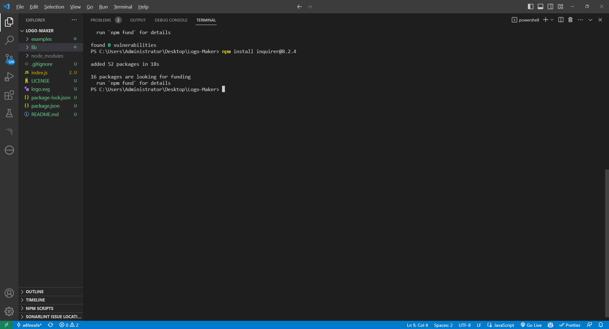
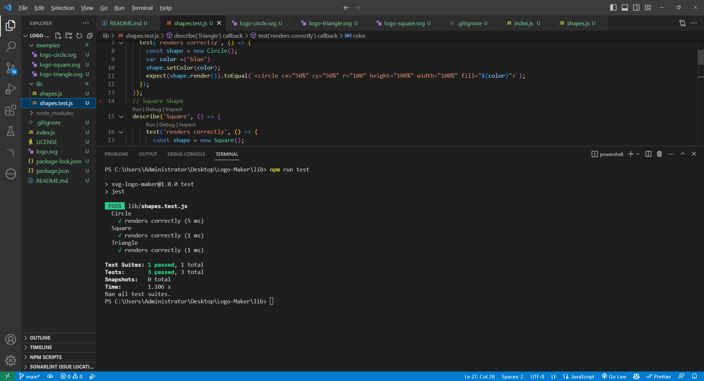

# SVG-Logo-Maker
Week-10 Challenge

## Table of Contents

 * [Description](#description)

 * [Live-Screen-Recording-of-Application-Functionality](#live-screen-recording-of-application-functionality)

 * [Screenshots](#screenshots)

 * [Technologies-Used](#technologies-used)

 * [Installation](#installation)

 * [Credits](#credits)

 * [Features](#features)

 * [Usage-Information](#usage-information)

 * [Contribution-Guidelines](#contribution-guidelines)

 * [Test-Instructions](#test-instructions)

 * [License](#license)

 * [Questions](#questions)

## Description

The application enables freelance web developers to create simple logos for clients and projects using a command-line interface. By prompting users through "inquirer," it collects input for logo content, color, shape, and shape color. The resulting SVG file generates the logo. The project's significance lies in introducing unit testing, demonstrating its value in ensuring accurate outputs. It emphasizes backend developers' capabilities without a graphical interface and underscores the importance of testing. The developer's evolving mindset is evident in error handling implementation. Future enhancements involve improved SVG color handling, expanded testing, and more design options.   

## Live Screen Recording of Application Functionality

Walkthrough video URL : https:

## Screenshots

Logo Generation

Examples of Generated Logos

## Technologies Used

This project is powered by Node.js v16, utilizes inquirer v8.2.4 (node package manager), and file system module (node package manager). It also employs jest v29.5.0 (node package manager) for the unit testing conducted in this application. 

## Installation

1. Clone the repo:
   git clone https://github.com/abdulsamedtma/svg-Logo-Maker.git 

2. Open in VS Code. If you do not have VS code you must install it.

3. Using the terminal, install node.js v16. If you have homebrew, the command should look like the following (brew install node@16), however this may vary and the documentation should be consulted.

4. Once node.js v16 is installed, in the terminal, utilize the command npm init -y to initialize and create a package.json where project files will be stored.

5. Next, use the terminal to run the command npm i to install the dependencies associated with this application (developers may need to install inquirer and jest directly from the command line, to do so the command for inquirer will be npm i inquirer@8.2.4 to install v8.2.4 of the inquirer, and npm i jest to install the latest version of jest).

6. To run the application, within the terminal, type the command node index.js.

## Credits

Worked with tutor Martin Goldberg to help get me started on this assignment. We pseudo-coded the general outline together and he helped me put together the unit testing portion of this assignment. 

## Features

Features of this application include the users ability to generate any logo quickly and easily through the use of SVG files, entirely from the command line. No UI (user interface) needed, and no front end tools needed.  

## Usage Information

To run this application, use the command line to navigate to the directory of the application, install all dependencies (npm i), then type the command node index.js. You will then be taken through a series of questions. Once all questions have been answered properly, a message will display to the command line telling you your logo has been generated. Find your new logo in the newly generated SVG file.

For unit testing instructions, navigate to the Test Instructions section.

## Contribution Guidelines

Open to collaboration, if you choose to do so open an issue and modify any changes you would like to see on a feature branch and wait for approval before merging to the main branch.

## Test Instructions

To run unit testing, open the terminal, and use the command npm run test.

As of now there is one test suite with three tests. The test suite is checking for a render() method to return a string for the corresponding SVG file with the given shape color.

## License

NOTICE: This application is covered under the MIT License

## Questions

Have additional questions? Click the links below to reach me through my GitHub account or Email address.

[Link to Github](https://github.com/abdulsamedtma)

<a href="mailto:abdulsamedtma@gmail.com">abdulsamedtma@gmail.com</a>

               This SVG Logo-Maker was generated with ❤️ using Node.js command-line. ✨  Every day is a learning day!  ✨
